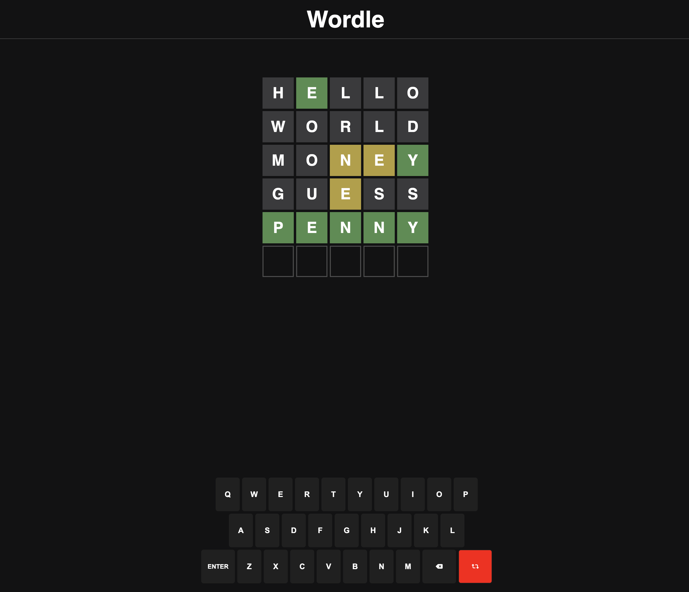

# Wordle
Wordle is a web-based word game created and developed by Welsh software engineer Josh Wardle. It was bought by the New York Times Company in 2022, who has since maintained and published it.

I made my Wordle clone by HTML, CSS, and JavaScript.

## Usage
To play the game, clone the repository and open the index.html in your browser:

At the start, you'll have a random word from [RapidApi](https://rapidapi.com/sheharyar566/api/random-words5/).
Repeat until you either guess the word or run out of six attempts.
Wether you win or lose, you can start over by generate a new word by pressing the [ESC] or clicking the red button.

## Credits
This project was created by me.
The original Wordle game was created by Jonathan Feinberg and is available at https://www.nytimes.com/puzzles/wordle.

## Game

